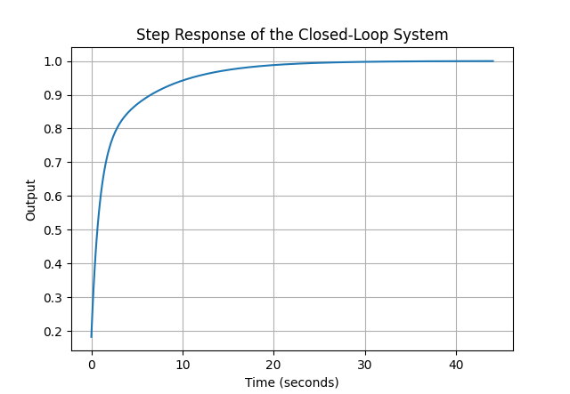
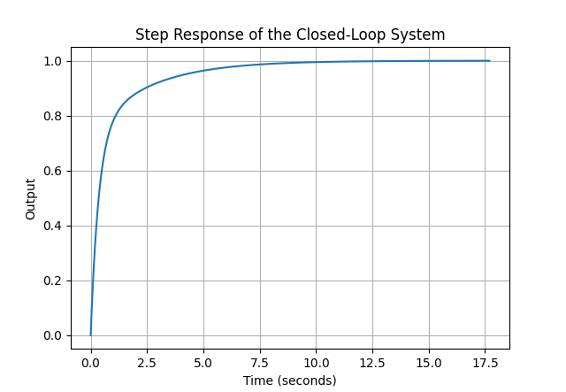
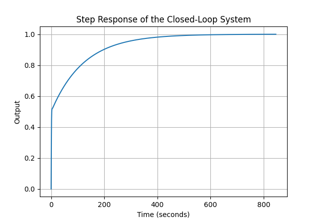

# Non-overshooting PD and PID Controllers Design

This repository hosts Python scripts developed to implement the methodologies presented in the paper "Non-overshooting PD and PID controllers design". These scripts simulate the behavior of controllers for specific system types to ensure non-overshooting step responses.

## Scripts Overview

1. `firstPID.py` 
2. `SecondPD.py` 
3. `SecondPID.py` 

### Script firstPID.py
Implements the non-overshooting PID controller design for first-order systems. It calculates PID parameters, verifies them against specific inequalities, and simulates the system response.

**Sample Plant Function:**
G(s) = K / (1 + Ts)  
Where K>0 (gain) and T>0 (time constant).

<figure>
    
    <figcaption align="center">Step Response of the system </figcaption>
</figure>

<figure>
    
    <figcaption align="center">Python program interface and output </figcaption>
</figure>

### Script SecondPD.py
Focuses on PD controller design for integrating systems, performing similar computations and validations tailored to the characteristics of such systems.

**Sample Plant Function:**
G(s) = K / (s(1 + Ts))  
Where K>0 (gain) and T>0 (time constant).


<figure>
    
    <figcaption align="center">Step Response of the system </figcaption>
</figure>

<figure>
    
    <figcaption align="center">Python program interface and output</figcaption>
</figure>

### Script SecondPID.py
Handles the more complex scenario of non-overshooting PID controller design for second-order systems, ensuring robustness and no overshoot through rigorous parameter validation.

**Sample Plant Function:**
G(s) = K / (s^2 + As + B)  
Where K, A, and B are positive constants, and the system is stable.


<figure>
    
    <figcaption align="center">Step Response of the system </figcaption>
</figure>

<figure>
    
    <figcaption align="center">Python program interface and output </figcaption>
</figure>
## Dependencies

- Python 3.8 or higher
- NumPy
- control
- Matplotlib

You can install all required packages using:
```
pip install -r requirements.txt

```


## How to Run

Navigate to the script directory in your terminal and run the scripts as follows:
```bash
python filename.py
```
Example
```bash
python SecondPID.py
```

You'll need to then enter the parameters as asked by the python script.

## Conclusion

The provided Python scripts serve as practical tools for validating and simulating the performance of PID and PD controllers designed to meet specific non-overshooting criteria. They allow for hands-on experimentation with controller design parameters, offering an educational insight into advanced control systems design.
